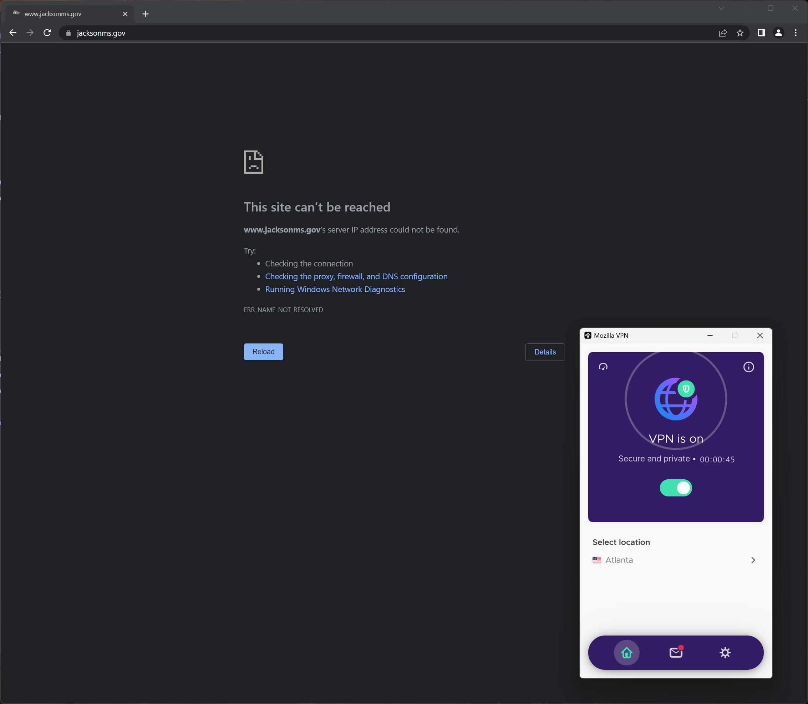
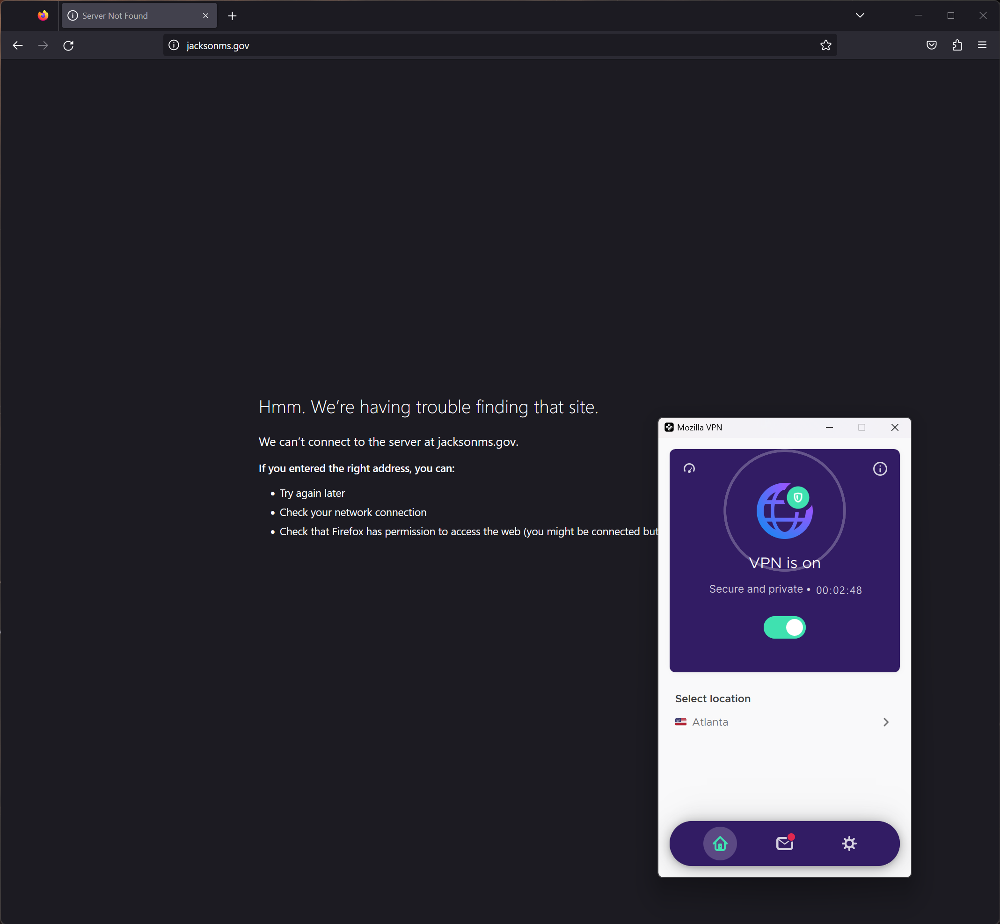

# The Walls of Jackson Have Fallen

## Question

Why can't [Patrick](https://twitter.com/PearlRiverFlow/status/1643750510435135488) open the City of Jackson's website?

1. If Patrick is on Mozilla VPN from Atlanta, he cannot open the city's website.
2. If Patrick is *not* on Mozilla VPN, he can open the city's website.
3. (1) and (2) are true in both Chrome and Firefox.

## Method and Findings

1. Reproduce Patrick's browser scenario
2. Retrieve homepage on local network
3. Retrieve homepage from external host in (a) New York, (b) UK, and (c) Germany

For steps (2) and (3), I'm using my poke-page script. It takes a URL and dumps headers and body for a request ignoring redirects and for a request that follows redirects.

### Reproducing Patrick's browser scenario

In both Chrome and Firefox, I was unable to open the city's website while using MozillaVPN set to Atlanta.

### Retrieve homepage on local network

1. Ubuntu WSL on home network, without VPN:
   1. `jacksonms.gov`: `200 OK` ([headers+body](./jacksonms.gov--local--no-vpn--follow-redirects--body))
   2. Control: `200 OK` ([headers+body](./example.com--local--no-vpn--follow-redirects--body))
2. Ubuntu WSL on home network, with VPN (Atlanta):
   1. `jacksonms.gov` `Could not resolve host: jacksonms.gov` ([headers+body](./jacksonms.gov--local--vpn--follow-redirects--body))
   2. Control: `200 OK` ([headers+body](./example.com--local--vpn--follow-redirects--body))

### Retrieve homepage from external host

1. Ubuntu, NYC:
   1. `jacksonms.gov`: `200 OK` ([headers+body](./jacksonms.gov--nyc--follow-redirects--body))
   2. Control: `200 OK` ([headers+body](./example.com--nyc--follow-redirects--body))
2. Ubuntu, UK:
   1. `jacksonms.gov`: `200 OK` ([headers+body](./jacksonms.gov--uk--follow-redirects--body))
   2. Control: `200 OK` ([headers+body](./example.com--uk--follow-redirects--body))
3. Ubuntu, Germany:
   1. `jacksonms.gov`: `200 OK` ([headers+body](./jacksonms.gov--germany--follow-redirects--body))
   2. Control: `200 OK` ([headers+body](./example.com--germany--follow-redirects--body))

## Results

After checking from several different several remote hosts, the issue is MozillaVPN. The city's homepage is available in every remote server and my local machine without VPN.
